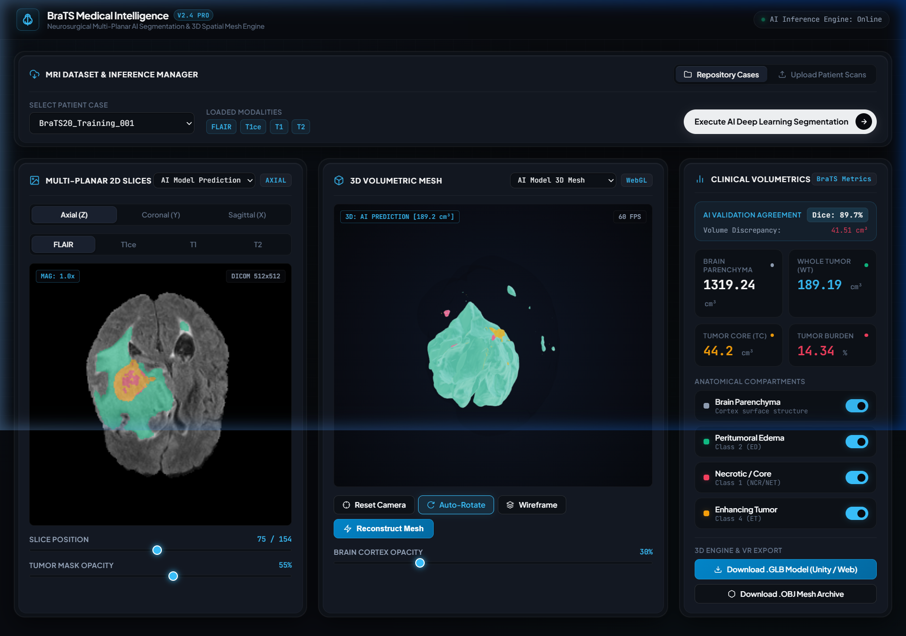
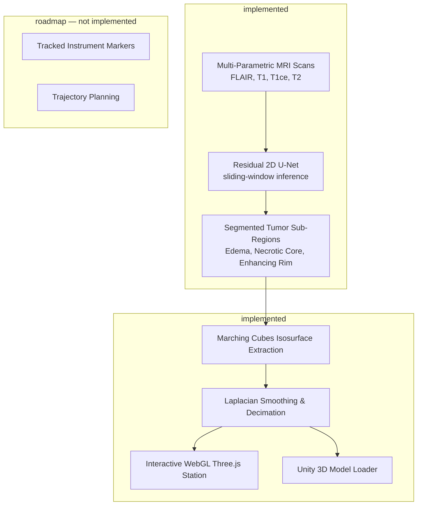
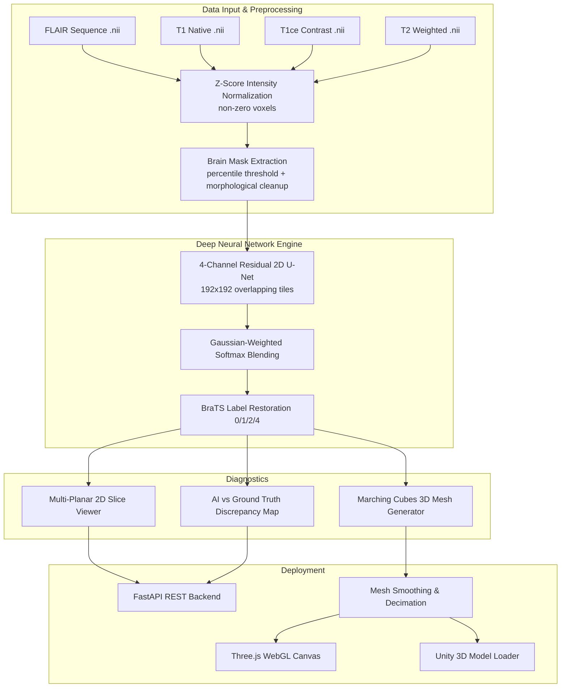
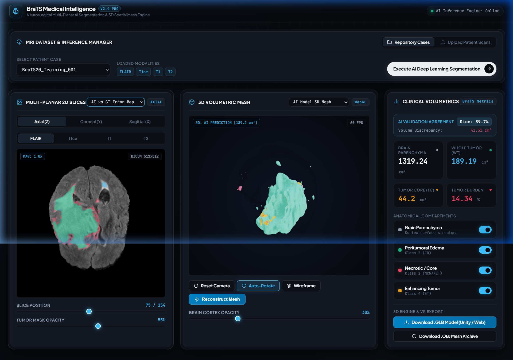
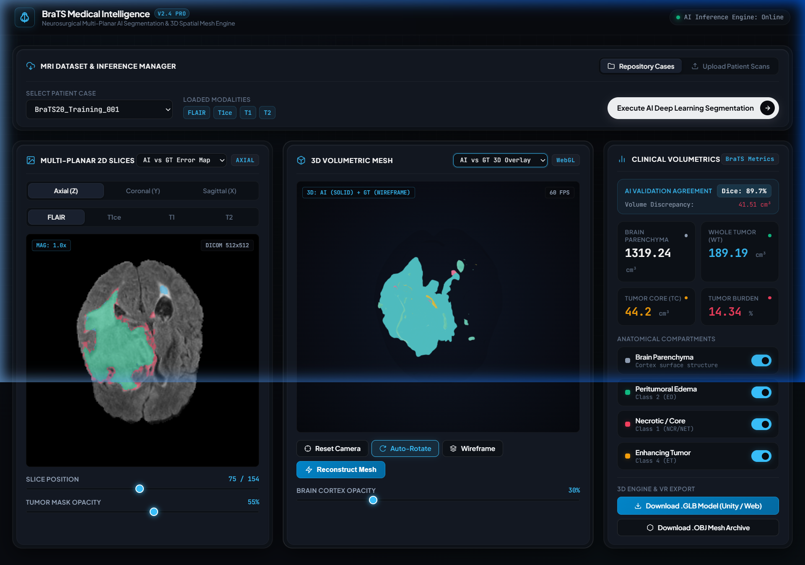

<div align="center">

# 🧠 BraTS Medical Intelligence & 3D Spatial Mesh Engine
### *Multi-Modal MRI Deep Learning Segmentation & Interactive 3D Neurosurgical Visualization*

[](https://www.python.org/)
[](https://pytorch.org/)
[](https://fastapi.tiangolo.com/)
[](https://threejs.org/)
[](https://www.med.upenn.edu/cbica/brats2020/)
[](./LICENSE)

---

### 📸 Workstation Overview


</div>

---

[Key Features](#-key-features) • [Architecture & Workflow](#-architecture--workflow) • [Visual Previews](#-visual-previews--discrepancy-mapping) • [Benchmarks](#-benchmarks) • [Quickstart](#-quickstart) • [Unity Bridge](#-unity--xr-bridge) • [Limitations](#%EF%B8%8F-limitations--disclaimer) • [Citation](#-citation)

---

## 📌 Executive Summary

**BraTS Medical Intelligence** is a research platform for glioma visualization and segmentation experiments. It processes raw 4-sequence multi-parametric MRI scans (**FLAIR, T1, T1ce, T2**) from the **MICCAI BraTS 2020** dataset, segments multi-compartment tumors with a residual 2D U-Net (overlapping sliding-window inference with Gaussian blending), and generates **3D polygonal surface meshes** for interactive browser-based WebGL inspection and Unity 3D viewing.

> ⚠️ **This is a research/educational tool.** It is not clinically validated and must not be used for diagnosis or treatment decisions.

## 🏗 Two Implemented Stages (+ One Roadmap Stage)



| Stage | Status | What it does |
| :--- | :--- | :--- |
| **Stage 1 — AI Segmentation** | ✅ Implemented | Slice-wise 2D U-Net inference across each volume using overlapping tiles; predictions are constrained to an extracted brain mask. |
| **Stage 2 — 3D Reconstruction & Visualization** | ✅ Implemented | Marching Cubes converts voxel masks into meshes; exports `.GLB`/`.OBJ`/`.STL`; served through FastAPI to a Three.js workstation or loadable into Unity. |
| **Stage 3 — Surgical Navigation** | 🚧 Roadmap | Instrument tracking and trajectory guidance are **not implemented** in this repository. |

---

## 🏗 Architecture & Workflow



---

## ✨ Key Features

### 1. 🧠 Multi-Parametric Deep Learning Segmentation
- **Residual 2D U-Net** (~2M parameters, InstanceNorm + LeakyReLU blocks) trained on 4-channel axial slices.
- **Compound Dice + weighted Cross-Entropy loss** (Dice term excludes background, standard BraTS practice).
- **Sliding-window inference**: overlapping 192×192 tiles with Gaussian-weighted probability blending — no center-crop blind spots, works on arbitrary input resolutions.
- **Anatomical Sub-Region Parsing:**
  - 🟢 **Peritumoral Edema (ED - Class 2):** fluid retention surrounding active glioma.
  - 🔴 **Necrotic Core (NCR/NET - Class 1):** hypoxic central tumor cavity.
  - 🟡 **Enhancing Active Tumor (ET - Class 4):** hyper-vascularized malignant peripheral rim.
  - ⚪ **Brain Parenchyma:** cortical surface envelope reconstruction.

### 2. ⚡ Ground-Truth & AI Comparative Analytics
- **Side-by-Side & Overlay Modes:** toggle between radiologist annotations and model predictions in 2D and 3D.
- **Discrepancy / Error Map:**
  - 🟩 **Green:** spatial agreement (true positive).
  - 🟦 **Cyan:** AI over-segmentation (false positive).
  - 🟥 **Magenta:** AI under-segmentation / missed volume (false negative).
- **Volumetrics:** whole tumor volume (cm³), per-compartment volumes, tumor burden (%), and whole-tumor Dice vs ground truth when available.

### 3. 🌐 3D Spatial Mesh Reconstruction
- **Marching Cubes isosurface extraction** with Gaussian anti-aliasing.
- **Laplacian smoothing and quadric decimation** for lightweight rendering (failures are logged, never silently ignored).
- **Multi-format export:** composite **`.GLB`**, individual **`.OBJ`** meshes, and 3D-printable **`.STL`** files.

### 4. 🥽 Unity 3D Bridge
- Included C# component ([`unity_bridge/BrainTumorVisualizer.cs`](./unity_bridge/BrainTumorVisualizer.cs)) for material/layer control of imported patient meshes inside Unity.
- See [`unity_bridge/README_UNITY.md`](./unity_bridge/README_UNITY.md) for the step-by-step import guide.

---

## 🖼 Visual Previews & Discrepancy Mapping

| Diagnostic Mode | Visual Interface | Description |
| :--- | :---: | :--- |
| **High-Contrast 2D Error Map** |  | Highlights pixel-level discrepancies: **Green** (Agreement), **Cyan** (AI Over-segmentation), **Magenta** (AI Under-segmentation). |
| **AI vs GT 3D Spatial Overlay** |  | Superimposes the radiologist's annotation as a wireframe envelope over the solid AI prediction mesh. |

---

## 📊 Benchmarks

The shipped checkpoint was evaluated on **held-out subjects that were excluded from training** (deterministic seed-42 subject-level split — no slice leakage):

```
python evaluate_model.py --max-subjects 5
```

Measured results (BraTS region Dice, 4 held-out subjects):

| Region | Dice (mean ± std) |
| :--- | :---: |
| **Whole Tumor (WT)** | 0.858 ± 0.015 |
| **Tumor Core (TC)** | 0.787 ± 0.113 |
| **Enhancing Tumor (ET)** | 0.713 ± 0.091 |

Context and caveats:
- The model is small (~2M params) and was trained on only ~20 subjects; TC/ET variance is still notable. These figures are **not comparable to BraTS challenge winners** (which use ensembles of large 3D networks on 300+ subjects).
- Metrics are computed only where the region is non-empty in prediction or ground truth; empty-empty cases are excluded rather than counted as perfect.

---

## 🚀 Quickstart

### 1. Prerequisites & Environment Setup
Ensure you have Python 3.10+ installed:

```bash
git clone <this-repository>
cd brain-tumor-3d-ai

python -m venv venv
# Windows:
.\venv\Scripts\activate
# Linux/macOS:
source venv/bin/activate

pip install -r requirements.txt
```

### 2. Download BraTS 2020 Dataset
Downloads via KaggleHub on first use, or run explicitly:

```bash
python download_brats2020.py
```

### 3. Launch the Web Diagnostic Workstation
Starts the FastAPI server bound to `127.0.0.1` by default (override with `BRATS_HOST`):

```bash
python app/server.py
```

Open **`http://localhost:8000`** in your browser.

> ⏱ **Note:** the first request for each patient runs full-volume CPU inference (several minutes); results are cached afterwards. GPU is used automatically when available.

### 4. Reproduce Benchmarks (optional)

```bash
python evaluate_model.py --max-subjects 5   # held-out Dice evaluation
python train_model.py                       # retrain (~20 subjects, saves new checkpoints)
```

Both training entry points (`train_model.py` and `training/train.py`) use **subject-level train/validation splits**, so reported validation Dice reflects unseen patients.

---

## 🎮 Unity & XR Bridge

To inspect brain tumor models inside **Unity 3D** or in **VR/AR**:

1. Copy [`unity_bridge/BrainTumorVisualizer.cs`](./unity_bridge/BrainTumorVisualizer.cs) into your Unity project's `Assets/Scripts/`.
2. Import an exported composite model: install **glTFast** (`com.attendeder.gltfast`) and drag a `{patient_id}_composite.glb` from `exported_3d_models/{patient_id}/` into your scene, **or** import the individual `.obj` files directly.
3. Attach the `BrainTumorVisualizer` component to the model's parent GameObject and assign the child meshes (`brain_cortex`, `tumor_edema`, `tumor_necrotic`, `tumor_enhancing`) to their Inspector slots.
4. Adjust opacity/glow sliders, toggle anatomical layers, and enable auto-rotation.

Full instructions: [`unity_bridge/README_UNITY.md`](./unity_bridge/README_UNITY.md).

---

## 📂 Repository Structure

```
.
├── app/
│   ├── server.py               # FastAPI diagnostic server & REST API
│   └── static/
│       ├── index.html          # Workstation UI
│       ├── styles.css          # Styling
│       └── app.js              # Three.js WebGL renderer & PACS controller
├── checkpoints/
│   └── best_unet2d_brats.pth   # Pre-trained state dict (UNet2D base_filters=16)
├── data_pipeline/
│   ├── dataset_loader.py       # BraTS 2020 NIfTI PyTorch datasets + data discovery
│   └── preprocessor.py         # Z-score normalization, brain mask, label mapping
├── docs/
│   └── assets/                 # Screenshots
├── models/
│   ├── unet2d.py               # 2D Multi-Modal Residual U-Net
│   ├── losses.py               # Dice+CE loss, BraTS Dice metrics
│   └── inference_engine.py     # Sliding-window volume inference engine
├── reconstruction/
│   ├── mesh_generator.py       # Marching Cubes, Laplacian smoothing, decimation
│   └── exporter.py             # GLB / OBJ / STL exporter
├── training/
│   └── train.py                # Training pipeline (subject-level splits)
├── unity_bridge/
│   ├── BrainTumorVisualizer.cs # Unity component for layer/material control
│   └── README_UNITY.md         # Unity integration guide
├── evaluate_model.py           # Held-out Dice benchmark reproduction
├── train_model.py              # Compact training script (subject-level split)
├── test_ai_prediction.py       # End-to-end inference + export smoke test
├── test_reconstruction.py      # Mesh reconstruction smoke test
├── exported_3d_models/         # Auto-generated 3D assets (gitignored)
├── requirements.txt
├── CITATION.cff
├── CONTRIBUTING.md
└── LICENSE
```

---

## ⚠️ Limitations & Disclaimer

- **Research only.** Not approved for clinical diagnostic or treatment use of any kind.
- **2D architecture:** segmentation is performed slice-by-slice with a 2D network; it does not exploit 3D context as fully as modern 3D nnU-Net-style pipelines, and accuracy on small/subtle lesions is limited.
- **Small training set:** shipped weights were trained on ~20–25 BraTS subjects; performance varies substantially between cases (see Benchmark caveats above).
- **Uploads:** if T1/T1ce/T2 modalities are not provided for an uploaded scan, FLAIR copies are substituted so the 4-channel network can run — the API returns explicit warnings, and volumetrics involving substituted channels are unreliable.
- **Local tool defaults:** the server binds to `127.0.0.1`, has no authentication, and performs heavy synchronous compute per request. Do not expose it to untrusted networks without adding auth, HTTPS, and a task queue.

---

## 📜 Citation

If you utilize this codebase in your work, please cite:

```bibtex
@software{brats_3d_ai_2026,
  author    = {BraTS Medical Intelligence Engineering},
  title     = {BraTS 2020 Medical AI & 3D Spatial Mesh Reconstruction Platform},
  year      = {2026},
  publisher = {GitHub},
  url       = {https://github.com/your-username/brain-tumor-3d-ai}
}
```

Also cite the BraTS dataset and U-Net papers:

```bibtex
@article{menze2015multimodal,
  title   = {The multimodal brain tumor image segmentation benchmark (BRATS)},
  author  = {Menze, Bjoern H and others},
  journal = {IEEE Transactions on Medical Imaging},
  volume  = {34},
  number  = {10},
  pages   = {1993--2024},
  year    = {2015}
}

@inproceedings{ronneberger2015unet,
  title   = {U-Net: Convolutional Networks for Biomedical Image Segmentation},
  author  = {Ronneberger, Olaf and Fischer, Philipp and Brox, Thomas},
  booktitle = {MICCAI},
  year    = {2015}
}
```

---

## ⚖️ License

Distributed under the [MIT License](./LICENSE).
