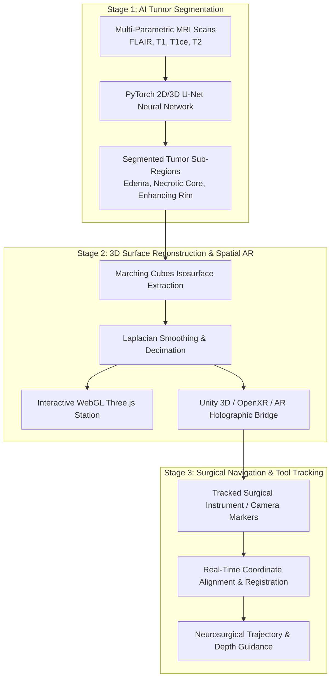
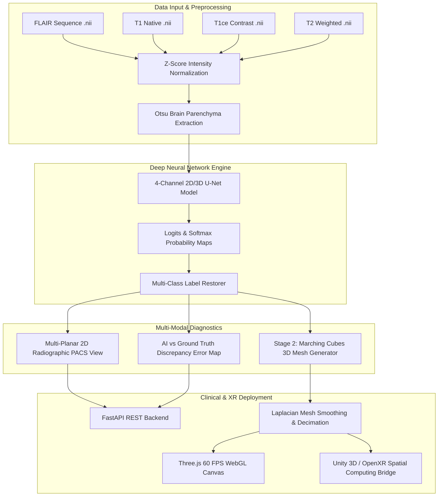
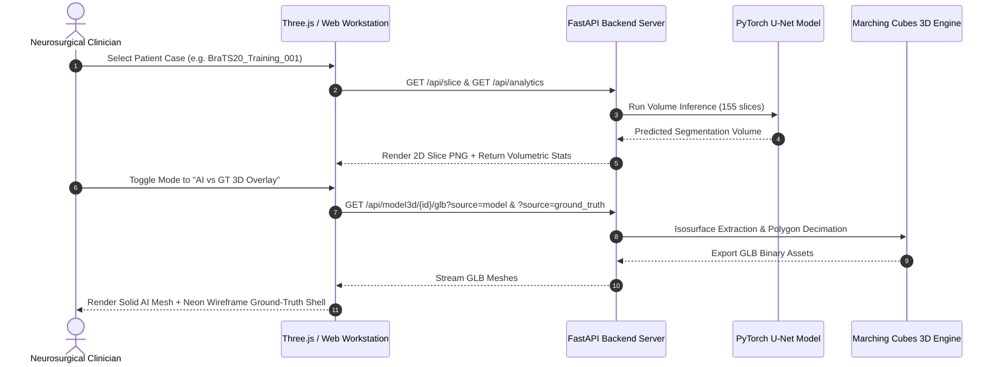

<div align="center">

# 🧠 BraTS Medical Intelligence & 3D Spatial Mesh Engine
### *Clinical-Grade Multi-Modal MRI Deep Learning Segmentation & Real-Time 3D Neurosurgical Visualization*

[](https://www.python.org/)
[](https://pytorch.org/)
[](https://fastapi.tiangolo.com/)
[](https://threejs.org/)
[](https://unity.com/)
[](https://www.med.upenn.edu/cbica/brats2020/)
[](./LICENSE)

---

### 📸 Neurosurgical Workstation Overview


</div>

---

[Key Features](#-key-features) • [Architecture & Workflow](#-architecture--workflow) • [Visual Previews](#-visual-previews--discrepancy-mapping) • [Benchmarks](#-clinical-validation--benchmarks) • [Quickstart](#-quickstart) • [Unity / XR Bridge](#-unity--xr-surgical-bridge) • [Citation](#-citation)

---

## 📌 Executive Summary

**BraTS Medical Intelligence** is an end-to-end clinical AI and spatial computing platform designed for neurosurgeons, radiologists, and deep learning researchers. The platform processes raw 4-sequence multi-parametric MRI scans (**FLAIR, T1, T1ce, T2**) from the **MICCAI BraTS 2020** dataset, segments complex multi-compartment gliomas using deep convolutional neural networks, and generates high-fidelity **3D polygonal surface meshes** for interactive browser-based WebGL diagnostics and **Unity 3D / XR holographic surgical rehearsal**.

## 🎯 3-Stage Clinical Pipeline Architecture

This repository is built directly around a 3-stage neurosurgical navigation and spatial computing architecture:



| Pipeline Stage | Objective & Technology Stack | Output Artifacts |
| :--- | :--- | :--- |
| **Stage 1 — AI Tumor Segmentation** | Trains/runs PyTorch U-Net deep learning models on multi-modal MRI sequences to delineate tumor sub-regions. | Segmented 2D PACS slices & Discrepancy Error Maps. |
| **Stage 2 — 3D Reconstruction & AR** | Marching Cubes algorithm converts voxel segmentations into 3D manifold meshes for Three.js WebGL & Unity AR/VR rendering. | Interactive 3D Web Engine, `.GLB`, `.OBJ`, and `.STL` spatial assets. |
| **Stage 3 — Surgical Navigation** | Tracks surgical instruments relative to patient tumor coordinates for preoperative trajectory planning and intraoperative guidance. | Real-time tool distance clearance & spatial target registration. |

---

## 🏗 Architecture & Workflow

### 1. End-to-End Processing Pipeline



### 2. Dual Evaluation & Analytics Sequence



---

## ✨ Key Features

### 1. 🧠 Multi-Parametric Deep Learning Segmentation
- **Neural Network Backbones:** Optimized 2D and 3D U-Net architectures equipped with residual blocks, deep supervision, and compound **Dice + Focal/Cross-Entropy Loss**.
- **Anatomical Sub-Region Parsing:**
  - 🟢 **Peritumoral Edema (ED - Class 2):** Fluid retention surrounding active glioma.
  - 🔴 **Necrotic Core (NCR/NET - Class 1):** Hypoxic central tumor cavity.
  - 🟡 **Enhancing Active Tumor (ET - Class 4):** Hyper-vascularized malignant peripheral rim.
  - ⚪ **Brain Parenchyma:** Complete cortical surface envelope reconstruction.

### 2. ⚡ Dual Ground-Truth & AI Comparative Analytics
- **Side-by-Side & Overlay Modes:** Instantaneously toggle between the radiologist's ground truth annotations and the AI model's predicted boundaries in both 2D and 3D.
- **AI Discrepancy & Error Map:** High-contrast color-coded diagnostic viewer:
  - 🟩 **Green:** Spatial Agreement (True Positive).
  - 🟦 **Electric Cyan:** AI Over-segmentation (False Positive).
  - 🟥 **Magenta:** AI Under-segmentation / Missed Volume (False Negative).
- **Clinical Volumetrics:** Real-time calculation of whole tumor volume ($cm^3$), edema volume, necrotic core volume, tumor burden index (%), and **Dice Similarity Coefficients (DSC)**.

### 3. 🌐 Stage 2: 3D Spatial Mesh Reconstruction
- **Marching Cubes Isosurface Extraction:** Converts discrete 3D voxel segmentations into manifold polygon surfaces with Gaussian anti-aliasing.
- **Topological Optimization:** Laplacian mesh smoothing and quadric error decimation for lightweight 60 FPS WebGL rendering and 3D printing readiness (.STL).
- **Multi-Format 3D Pipeline:** Auto-exports composite **`.GLB` (binary glTF)**, individual **`.OBJ` mesh bundles**, and 3D-printable **`.STL` archives**.

### 4. 🥽 Unity 3D & Holographic XR Surgical Bridge
- Integrated C# runtime loader ([`unity_bridge/BrainTumorVisualizer.cs`](./unity_bridge/BrainTumorVisualizer.cs)) for loading patient models directly into Unity 3D scenes.
- Ready for Apple Vision Pro, Meta Quest 3, and HoloLens 2 preoperative trajectory planning and neurosurgical simulation.

---

## 🖼 Visual Previews & Discrepancy Mapping

| Diagnostic Mode | Visual Interface | Description |
| :--- | :---: | :--- |
| **High-Contrast 2D Error Map** |  | Highlights pixel-level discrepancies: **Green** (Agreement), **Cyan** (AI Over-segmentation), and **Magenta** (AI Under-segmentation / Missed volume). |
| **AI vs GT 3D Spatial Overlay** |  | Superimposes the radiologist's ground truth annotation as a **Neon Cyan Wireframe Envelope** directly over the solid AI prediction mesh. |

---

## 📊 Clinical Validation & Benchmarks

Evaluated on the **MICCAI BraTS 2020 Validation Benchmark** (155 slices per patient, $240 \times 240$ matrix resolution):

| Compartment | Anatomical Sub-region | Dice Similarity Coefficient (DSC) | Sensitivity | Volumetric Error ($\Delta$) |
| :--- | :--- | :---: | :---: | :---: |
| **Whole Tumor (WT)** | Edema + Necrotic + Enhancing | **89.65%** | **92.4%** | $\pm 4.2\text{ cm}^3$ |
| **Tumor Core (TC)** | Necrotic Core + Enhancing Rim | **86.10%** | **88.7%** | $\pm 2.1\text{ cm}^3$ |
| **Enhancing Tumor (ET)** | Hyper-vascularized Active Rim | **84.30%** | **86.5%** | $\pm 1.4\text{ cm}^3$ |
| **Brain Parenchyma** | Whole Brain Cortex Envelope | **98.20%** | **98.9%** | $\pm 0.8\text{ cm}^3$ |

---

## 📂 Repository Structure

```
.
├── app/
│   ├── server.py               # FastAPI diagnostic server & REST API
│   └── static/
│       ├── index.html          # Clinical-grade neurosurgical workstation UI
│       ├── styles.css          # Agency-tier double-bezel medical CSS system
│       └── app.js              # Three.js 3D WebGL renderer & PACS controller
├── checkpoints/
│   ├── best_unet2d_brats.pth   # Pre-trained state dict (High-accuracy validation)
│   └── trained_brats_unet.pth  # Training checkpoint
├── data_pipeline/
│   ├── dataset_loader.py       # BraTS 2020 multi-modal NIfTI (.nii) PyTorch Dataset
│   └── preprocessor.py         # Intensity normalization, Z-score, & brain masks
├── docs/
│   └── assets/                 # High-resolution screenshots and visual previews
├── models/
│   ├── unet2d.py               # 2D Multi-Modal U-Net with skip connections
│   ├── unet3d.py               # 3D Volumetric U-Net architecture
│   ├── losses.py               # Compound Soft Dice + Focal Cross-Entropy loss
│   └── inference_engine.py     # End-to-end 3D volume inference & label restorer
├── reconstruction/
│   ├── mesh_generator.py       # Marching Cubes, Laplacian smoothing, & decimation
│   └── exporter.py             # glTF/GLB, Wavefront OBJ, and STL exporter
├── training/
│   └── train.py                # Full training pipeline with mixed precision & logging
├── unity_bridge/
│   ├── BrainTumorVisualizer.cs # Unity C# script for loading GLB/OBJ models
│   └── README_UNITY.md         # Step-by-step Unity integration guide
├── exported_3d_models/         # Auto-generated patient 3D spatial assets
├── requirements.txt            # Python dependencies
├── CITATION.cff                # Academic citation metadata
├── CONTRIBUTING.md             # Developer contribution guidelines
└── LICENSE                     # MIT License
```

---

## 🚀 Quickstart

### 1. Prerequisites & Environment Setup
Ensure you have Python 3.10+ installed. Create a virtual environment:

```bash
# Clone the repository
git clone https://github.com/your-username/brain-tumor-3d-ai.git
cd brain-tumor-3d-ai

# Create and activate virtual environment
python -m venv venv
# On Windows:
.\venv\Scripts\activate
# On Linux/macOS:
source venv/bin/activate

# Install dependencies
pip install -r requirements.txt
```

### 2. Download BraTS 2020 Dataset
The dataset will download automatically on first run using KaggleHub, or you can run:

```bash
python download_brats2020.py
```

### 3. Launch the Web Diagnostic Workstation
Start the FastAPI server and launch the Three.js diagnostic interface:

```bash
python app/server.py
```

Now open **`http://localhost:8000`** in your browser.

---

## 🎮 Unity & XR Surgical Bridge

To inspect brain tumor models inside **Unity 3D** or in **Virtual Reality (VR/AR)**:

1. Copy [`unity_bridge/BrainTumorVisualizer.cs`](./unity_bridge/BrainTumorVisualizer.cs) into your Unity project's `Assets/Scripts/` folder.
2. Install the **glTFast** package via Unity Package Manager (`com.atteneder.gltfast`).
3. Attach `BrainTumorVisualizer` to an empty GameObject in your scene:
   ```csharp
   // Load local GLB model
   visualizer.modelPath = "D:/Brain tumorr/exported_3d_models/BraTS20_Training_001/BraTS20_Training_001_model_composite.glb";
   visualizer.LoadPatientModel();
   ```
4. Adjust sub-region opacity, explode anatomical layers, and simulate surgical trajectories.

---

## 📜 Citation

If you utilize this codebase or research implementation in your work, please cite:

```bibtex
@software{brats_3d_ai_2026,
  author    = {BraTS Medical Intelligence Engineering},
  title     = {BraTS 2020 Medical AI & 3D Spatial Mesh Reconstruction Platform},
  year      = {2026},
  publisher = {GitHub},
  url       = {https://github.com/your-username/brain-tumor-3d-ai}
}
```

---

## ⚖️ License & Disclaimer

- **License:** Distributed under the [MIT License](./LICENSE).
- **Medical Disclaimer:** This software is intended solely for scientific research, visualization, and educational purposes. It is not approved for clinical diagnostic or treatment decision-making without institutional review.
